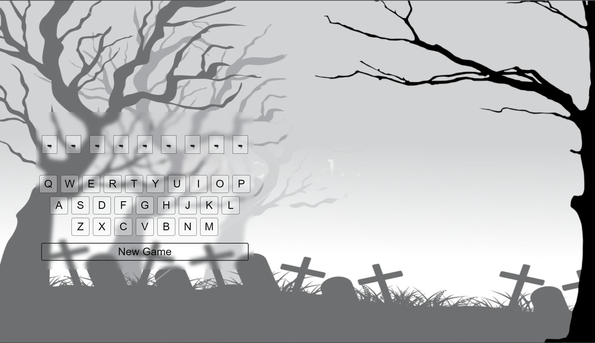
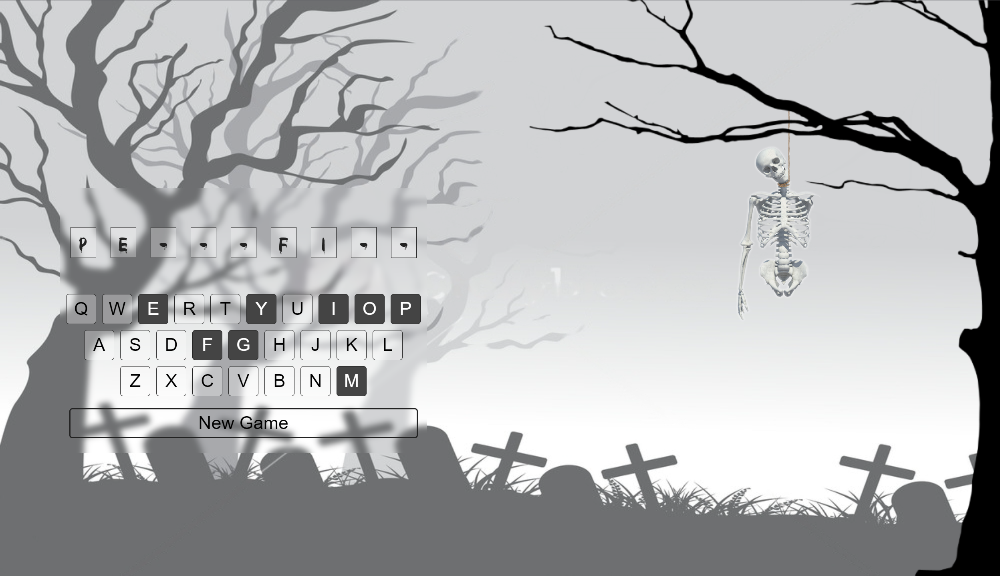

# Create the Hangman Game using HTML
## Assigment for Javascript course of MCSBT at IE

### Requirements:
- Create a Hangman Game
- Build a single page web
- Must be uploaded to a server
- Hangman must be done with graphics
- Word should be retrieved via API

### The Final Project

>1. First Page

>2. Chose Difficulty
 
>3. The game has begun!

>4. Into the game

>A. You Won Page
>
>B You Lost Page
>
>5. The game starts again

### Possible Improvements:
- Currently, reached the maximum completion that makes for an easy development in HTML, to improve code quality and readability future implementations should be done using React
- Tracking Systems for the points, to keep score of how many games the player has won or lost
- Games modes, for example: time challenge or start easy and increase complexity
- Improve animation quality by having custom animation designed
- Improve the support for table and mobile
- Multiplayer mode
